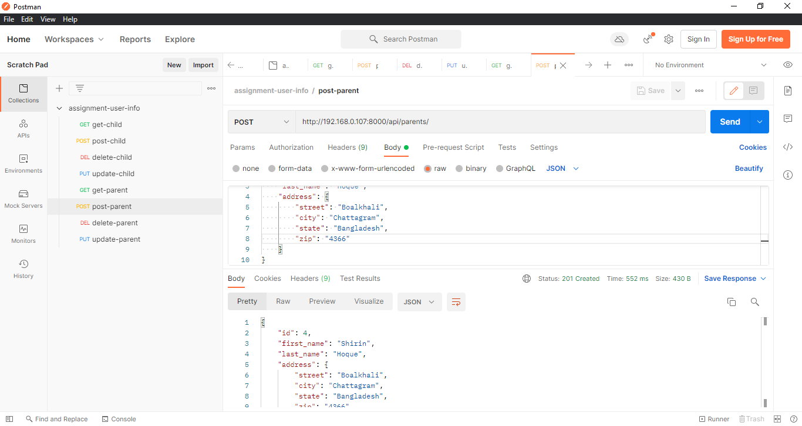
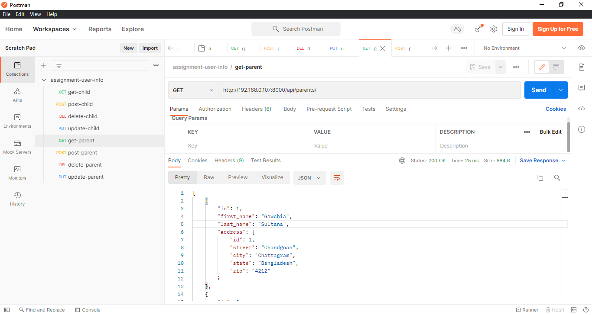
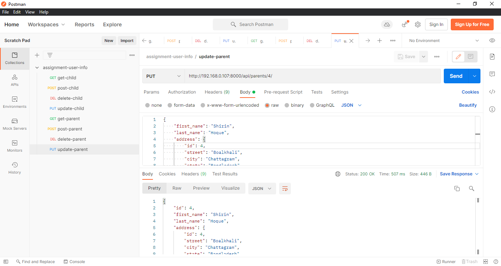
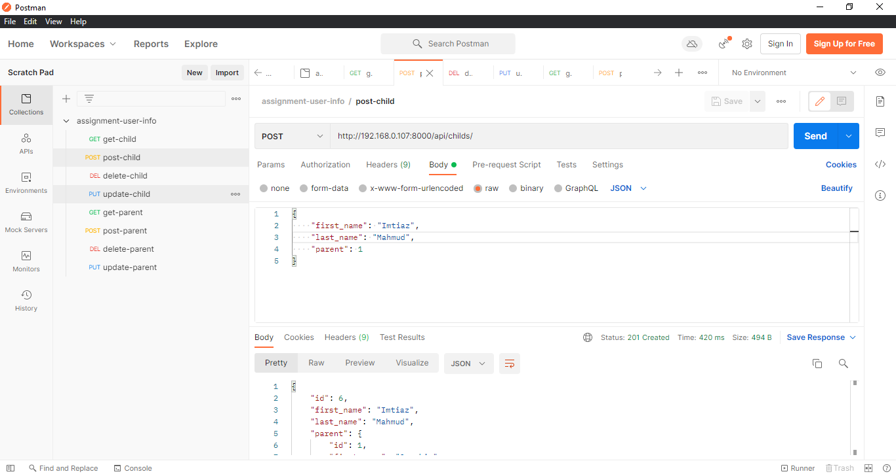
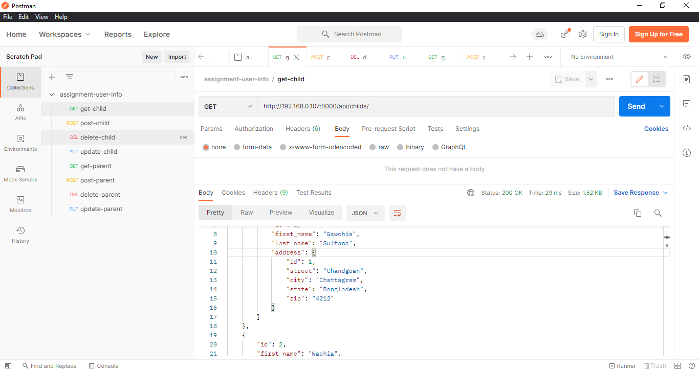
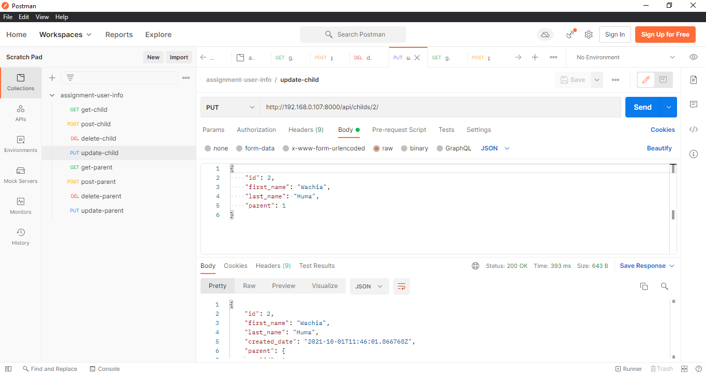

**Install and run project**
----

**Activate virtual environment:**

`.\venv\Scripts\activate`

**Move into project directory:**

`cd myproject`

**To run the project:**

```
python manage.py makemigrations

python manage.py migrate

python manage.py runserver
```

### Python Version: 3.7.3
----


**Tested the api using postman**
----
For creating parent user:



For getting parent user list:



For updating parent user:



For deleting parent user:


For creating child user:



For getting child user list:



For updating child user:



For deleting child user:

